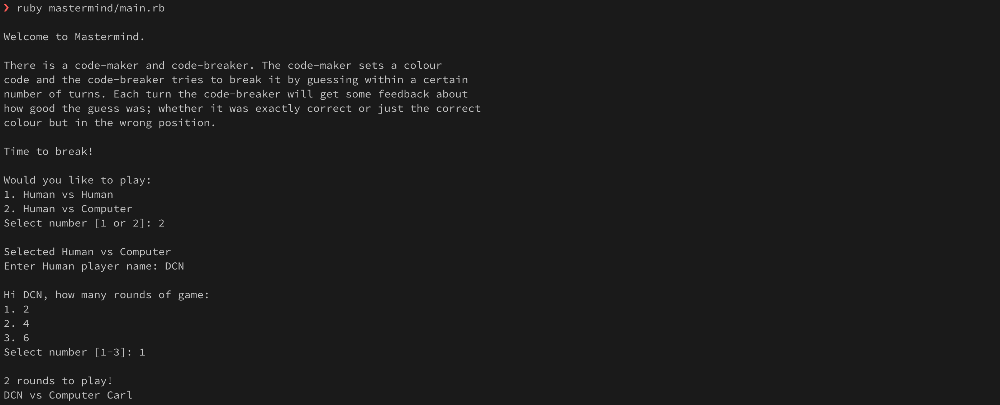
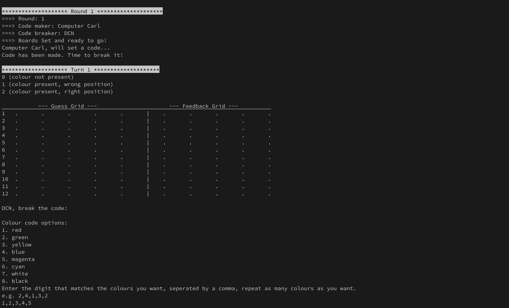
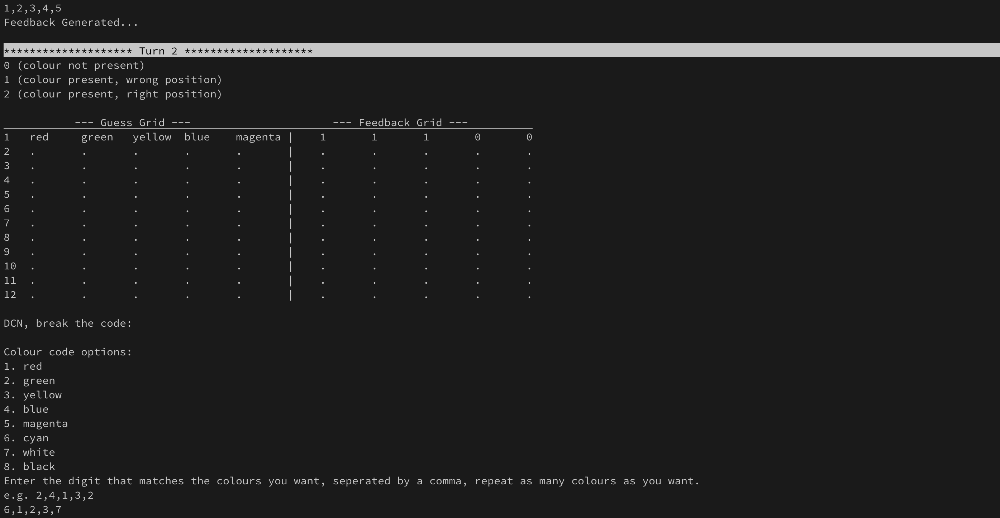
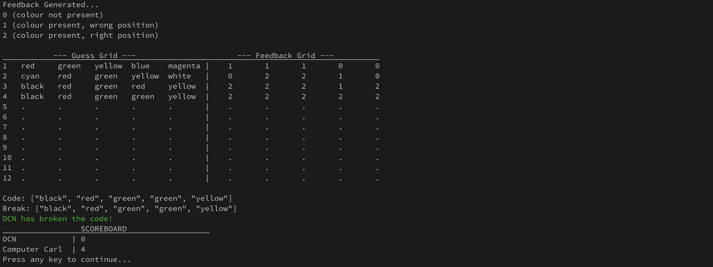
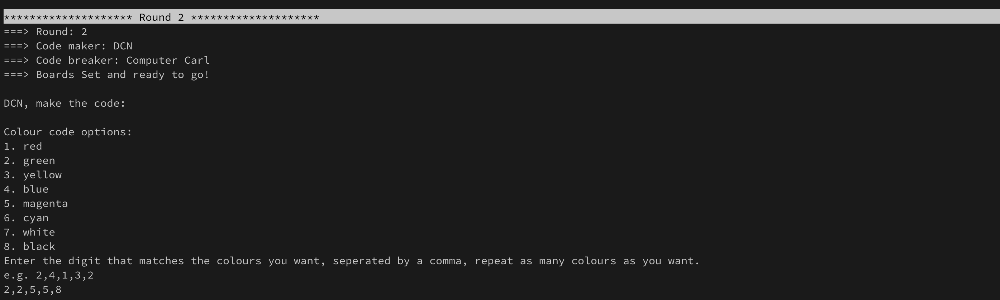
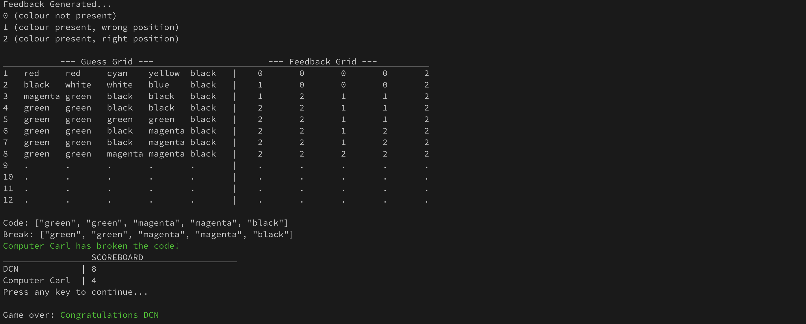

# Project: Mastermind

From [The Odin Project](https://www.theodinproject.com/lessons/ruby-mastermind)

> Build a Mastermind game from the command line where you have 12 turns to guess the secret code, starting with you guessing the computer’s random code.

## Usage
Use the following command to run the application
- from the __root__ folder:
```bash
ruby mastermind/main.rb
```
OR
- from inside the __mastermind__ folder
```bash
ruby main.rb
```
## Examples
1. Run the app and choose the setting for the game. The game will indicate who the code-maker and code-breaker are at the start.


2. If __Human vs Human__: the code-maker will be prompted to enter a secret code while the breaker looks away. If __Human vs Computer__: the computer will set a code in the background. Afterwards, the code-breaker should then type in code and press enter.


3. After each _turn_ the __Guess and Feeback grid__ should guide the code-breaker on their progress.


4. If the code-breaker breaks the code before they use up all their _turns_, then they're successful. The __Scoreboard__ is displayed. The code-maker is awarded points equal to the number of tries the code-breaker took to break the code. The more tries taken by the breaker, the better for the maker.


5. New _round_ commences, and the code-maker and code-breaker are switched.


6. After the final _round_, the __Scoreboard__ is displayed and the winner is announces.
