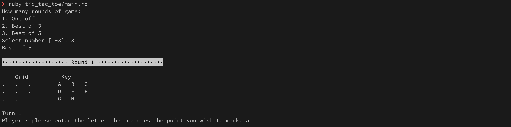
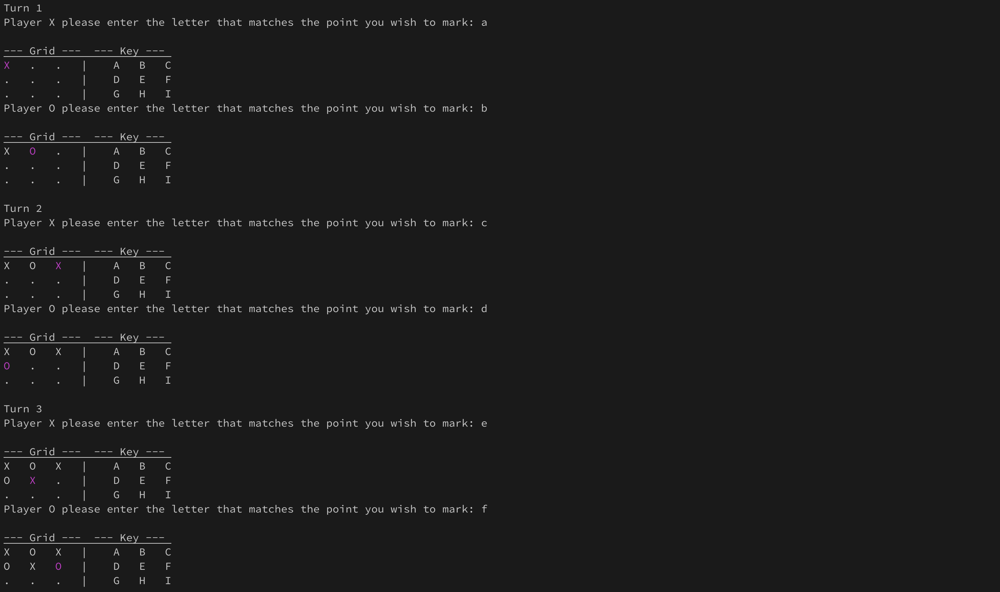
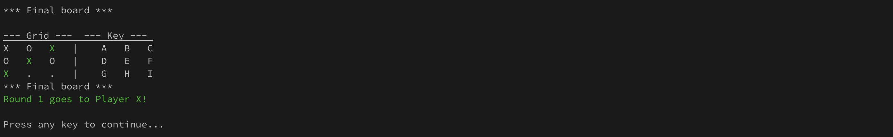
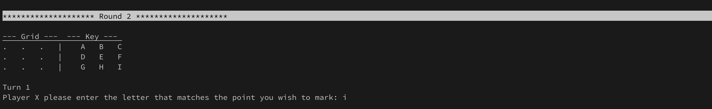
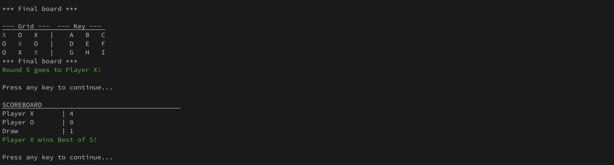

# Project: Tic Tac Toe

From [The Odin Project](https://www.theodinproject.com/lessons/ruby-tic-tac-toe)

> Build a tic-tac-toe game on the command line where two human players can play against each other and the board is displayed in between turns.

## Usage
Use the following command to run the application
- from the __root__ folder:
```bash
ruby tic-tac-toe/main.rb
```
OR
- from inside the __tic-tac-toe__ folder
```bash
ruby main.rb
```

## Examples
1. Run the app and choose number of rounds


2. Each player is given a turn to mark the board


3. First Player to complete set (column, row, or diagonal) wins the round


4. New round (in best of series) commences


5. First Player to complete set (column, row, or diagonal) within each round is awarded a point and a scoreboard is display
After the final round, the scoreboard is displayed and __best of series__ winner is announces

